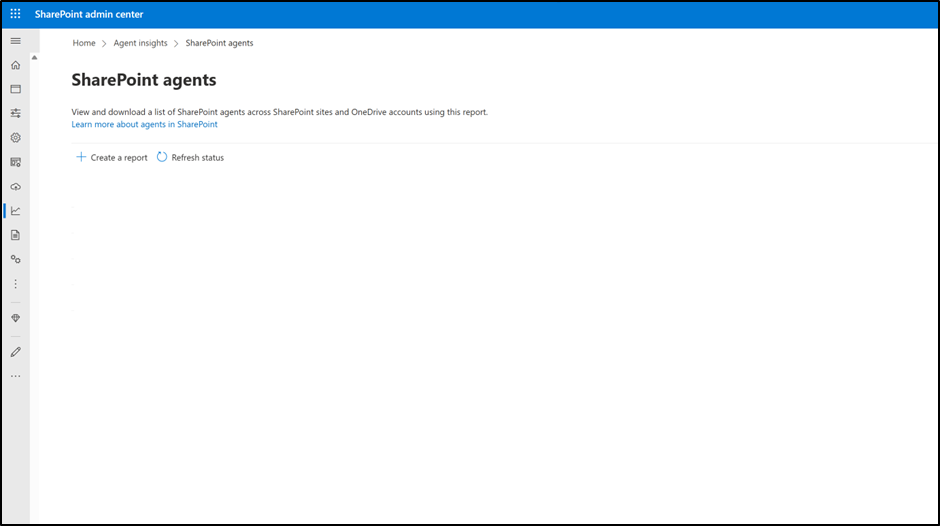
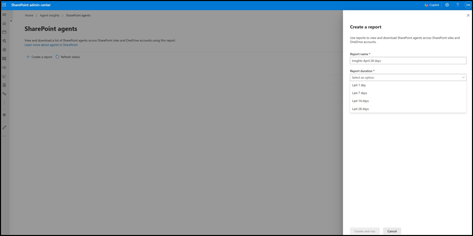
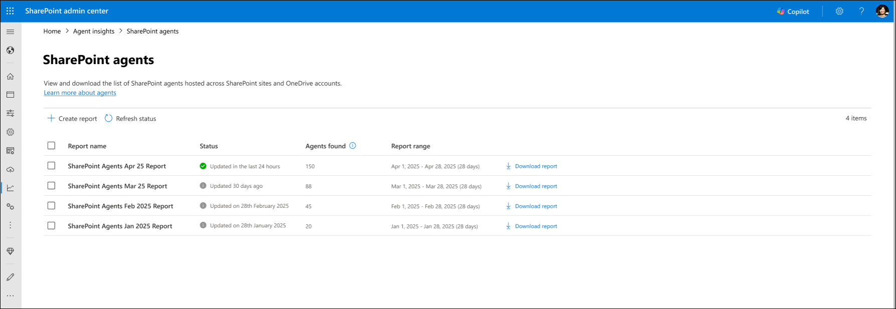
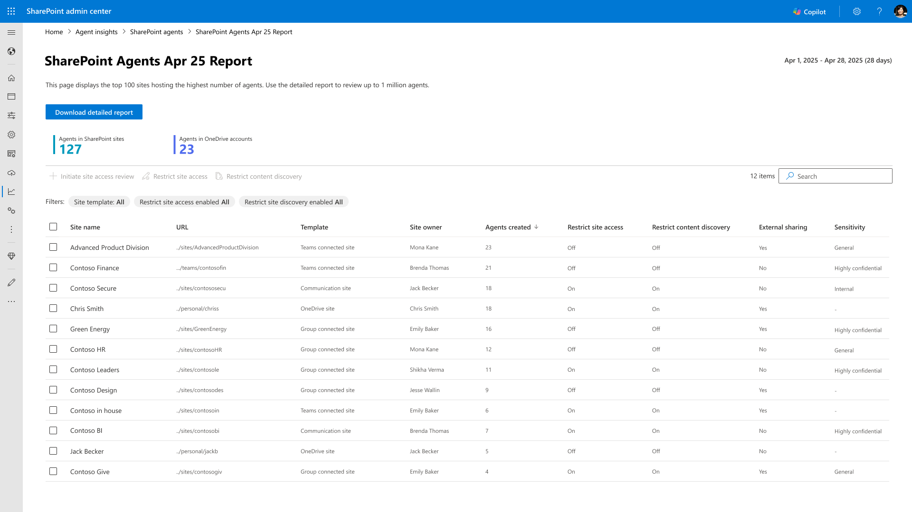
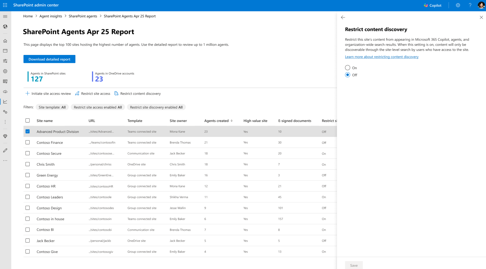

# SharePoint Agent Insights report in SharePoint Admin Center  
Insights report on SharePoint Agents provides SharePoint Administrators with rich information on the recently created SharePoint agents across all SharePoint sites and OneDrive sites within their organization. This report provides admins with the ability to learn about the sites with the highest number of agents created. Using this report, admins can further govern and maintain the integrity of the content used by agents as grounding data.  

Insights report is a [SharePoint Advanced Management](/sharepoint/advanced-management) feature and available in organization with SharePoint Advanced Management add-on SKU or Microsoft 365 Copilot license. The insights report is based on the Microsoft audit data logged for SharePoint agents through the FileCreated and FileRenamed events. 

You can generate and manage SharePoint Agent Insights report in SharePoint Admin Center.  

1. Sign in to the SharePoint admin center with your SharePoint admin credentials.
2. Tto generate and view these reports, ensure the organization has the SharePoint Advanced Management add-on SKU or Microsoft 365 Copilot license.
3. In the left pane, expand **Reports** and then select **Agent insights**.
4. On the Agent insights page, select **SharePoint agents - View reports**.

## Create reports

 
1. As SharePoint Administrator, you can generate the report by clicking on Create a report.  

2. Provide the Report name and under Report duration, specify the time frame for the report.  

    

3. Select **Create and run**. 
 
> [!NOTE]
> - A report can be rerun only after 24 hours since the last report was generated.
> - In large tenants, it might take up to 48 hours for the data to be available.
> - There can only be one report for each value of the report range. This means you can see a maximum of four reports at a given point.
> - The newly generated report replaces the previously created report with the same date range. To preserve the previously created report, download the report first before creating a new report for the same date range.

## View report status 

 
To check if a report is ready or when it was last updated, see the Status column.  

  

## View report  

When a report is ready, select it to view the data. You can view the top 100 records hosting the highest number of agents. You can search for sites or filter on the site template, and governance policies.  

## Apply Content governance policies  

You can further select a site and apply [Restrict site access policy](/SharePoint/restricted-access-control) or [Restrict Content Discovery policy](/sharepoint/restricted-content-discovery) on the site for content governance. 

 

> [!NOTE]
> After a policy is applied to the site from the insights report, the policy status on the existing report won't be updated. To view the updated status of the policy on the site, select the policy to view the latest status or access the Active site panel and review the site settings.

 
## SharePoint Agent Insights report in SharePoint PowerShell Module 
 
You can generate and manage SharePoint Agent Insights report using SharePoint Online Management Shell. 

1. [Download](https://www.microsoft.com/download/details.aspx?id=35588) and install the latest version of SharePoint Online Management Shell.
2. Connect to SharePoint Online as at least a [SharePoint administrator](/sharepoint/sharepoint-admin-role) in Microsoft 365. For more information, see [Getting started with SharePoint Online Management Shell](/powershell/sharepoint/sharepoint-online/connect-sharepoint-online).
3. To generate and view these reports, ensure the organization has the SharePoint Advanced Management add-on SKU or Microsoft 365 Copilot license.

With permissions of at least a SharePoint administrator, you can generate and view the insights using the following commands:  
 
1. To generate report for a one-day default report duration, run the command:  
 
`Start-SPOCopilotAgentInsightsReport`  

2. To generate a report for any other duration (1, 7, 14 or 28 days), run the command:  
 
`Start-SPOCopilotAgentInsightsReport -ReportPeriodInDays`  
 
For example, to generate report for the past 28 days, run the command:  
 
`Start-SPOCopilotAgentInsightsReport -ReportPeriodInDays <28>`
 
 

3. To check the status of all active and available reports, run the command:  
 
`Get-SPOCopilotAgentInsightsReport` 
 
 
4. To check the status of a specific report, run the command: 
 
`Get-SPOCopilotAgentInsightsReport –ReportId` 

5. To download and view the report, run the command: 
 
`Get-SPOCopilotAgentInsightsReport –ReportId -Action Download` 

`Get-SPOCopilotAgentInsightsReport –ReportId -Action View` 

 

6. To view further detailed reports, the following options are available: 
 

a. CopilotAgentsOnSites: Provides the name of all the agents currently available on all sites. This report contains up to 1,000,000 records.  

> [!NOTE]
> The default value for the `-Content` parameter is `CopilotAgentsOnSites`. 
 
`Get-SPOCopilotAgentInsightsReport –ReportId -Content CopilotAgentsOnSites`  

b. TopSites: Provides a list of 100 sites with the number of agents available on each site.  
 
`Get-SPOCopilotAgentInsightsReport –ReportId -Content TopSites`

c. SiteDistribution: Provides the summarized view of agents across all types of sites like Communication sites, Microsoft 365 group connected sites, OneDrive site, etc.  
 
`Get-SPOCopilotAgentInsightsReport –ReportId -Content SiteDistribution` 

## Known Experiences
  
- A report can be rerun only after 24 hours since the last report generated.  

- In large tenants, it might take up to 48 hours for the data to be available.  

- There can only be one report for each value of Report range. This means you can see a maximum of four reports at a given point.  

- The newly generated report replaces the previously created report with the same date range. To preserve the previously created report, download the report first before creating a new report for the same date range.  

- These reports are generated using Microsoft 365 unified audit data and might not cover all audit events. 