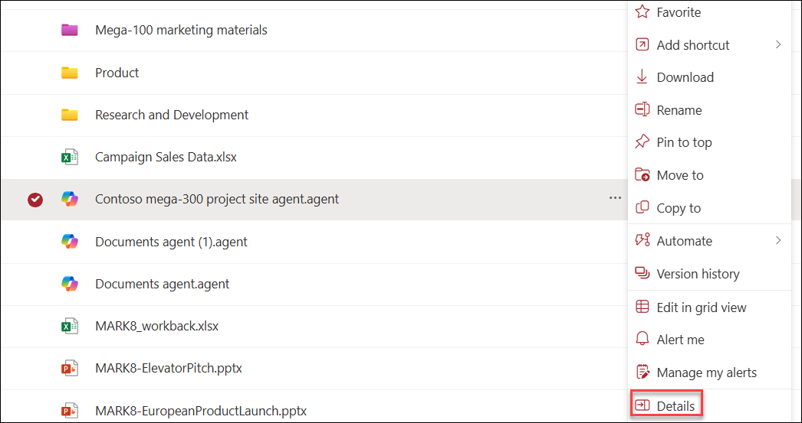
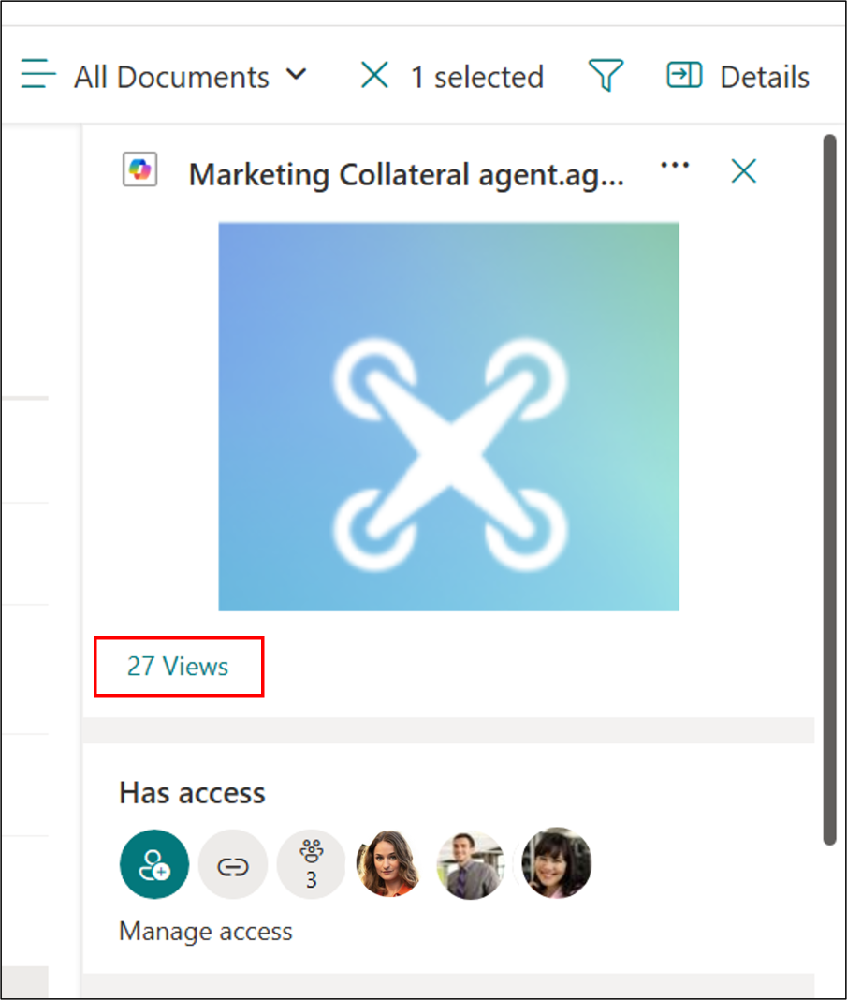
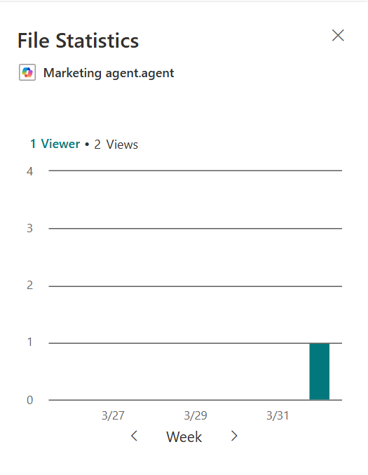
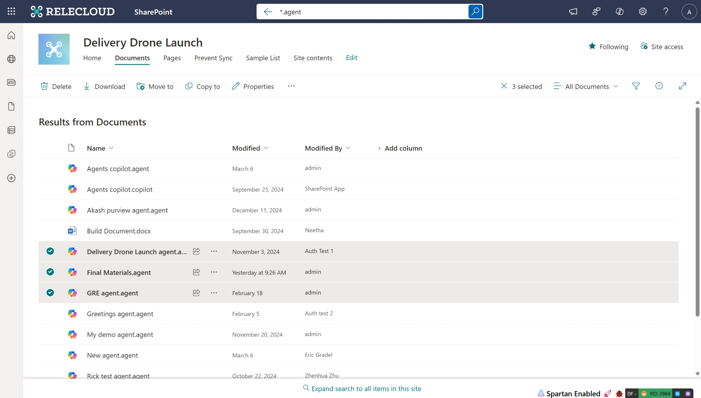
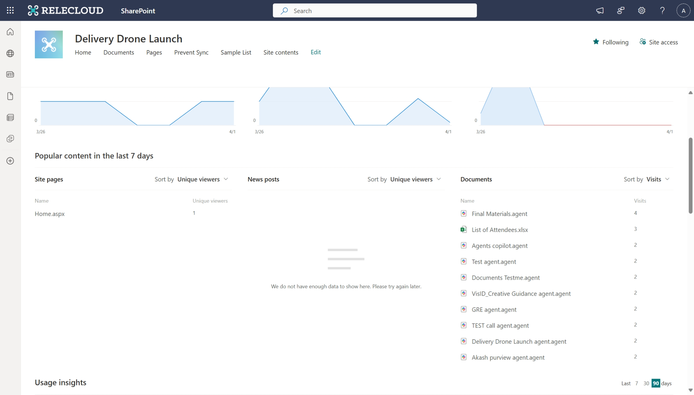
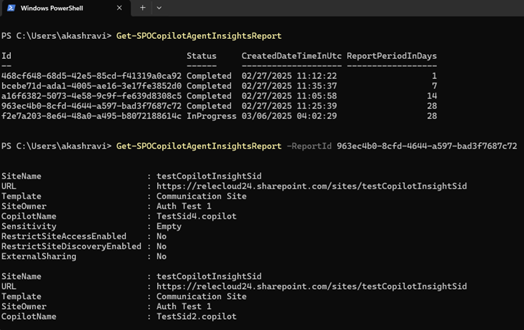
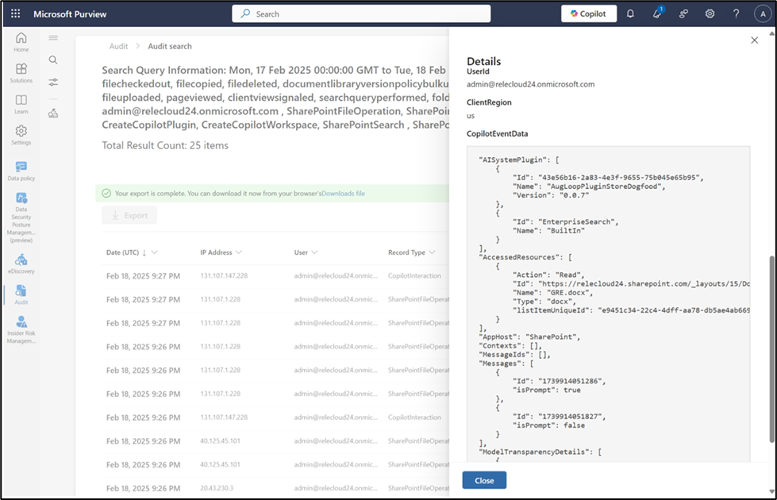
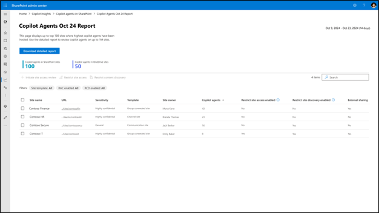

# Monitor SharePoint agent Usage

Monitoring SharePoint agent usage can be done through various tools and methods, each suited to the needs of specific user roles within the organization. This article outlines the options available for users with at least site visitor’s permissions and SharePoint admins. These two role groups have different ways to monitor and analyze the performance and usage of SharePoint agents in their respective areas.

> [!NOTE]
> To ensure that security and privacy settings are always honored, some of these tools are restricted to specific user roles.

The following outlines the tools and techniques available for monitoring SharePoint agent usage, categorized based on user roles and permissions:

- For **Users with at least site visitor's permissions** (site admins, site owners, site members and site visitors): 
    - **File statistics**: Users with at least site visitor's permissions can select an individual `.agent` file and use the Details pane to view its file statistics.
    - **Search**: Users with at least site visitor's permissions can use **Search** to find all agents on a site for bulk actions.
    - **Site usage**: Users with at least site visitor's permissions can use **Site usage** to see the most popular files and agents on their sites.

- For **SharePoint admins**:
    - **SharePoint Online Management Shell**: SharePoint admins can get an inventory of the agents created across sites at the organization level in a specified time period using SharePoint Online Management Shell.
    - **Microsoft Purview audit log**: SharePoint admins with Compliance admin permissions can use the [Microsoft Purview audit log](/microsoft-365/compliance/audit-log-search) to monitor agent creation and usage details across the organization.
    - **Microsoft Cost Management**: SharePoint admins can use [Microsoft Cost Management](/azure/cost-management-billing/cost-management-billing-overview) to monitor the cost of agent usage at the organization level.
    - **SharePoint Advanced Management**: Coming soon, SharePoint admins can use [SharePoint Advanced Management](/sharepoint/advanced-management) to obtain detailed insights on agent usage across sites. The report will list the number of agents that are created, along with details on policies such as Restricted Content Discovery and Restricted Access Control associated with a particular site.

These tools align with user roles and permissions, enabling monitoring and management of SharePoint agent activities.
The following provides additional details on how each tool functions and can be used effectively.

## Monitor agent usage with at least site visitor's permissions

### Check individual agent file’s usage with File Statistics

Since every SharePoint agent is a `.agent` file saved in the location where it's created, users with view permission to the file can check the `.agent` file's usage with File Statistics. File Statistics is one of the [file insights](https://support.microsoft.com/office/see-file-insights-before-you-open-a-file-87a23bbc-a516-42e2-a7b6-0ecb8259e026) available from the file card or details/info pane.
To check the .agent file's file statistics, select the `.agent` file, and then select **Details** to see the number of views and unique viewers.

In the Details pane, select the view count to review comprehensive information about the usage of the `.agent` file.

You can check the agent's file's usage by weekly **Viewers** or **Views**:

### Use Search to find all agents for bulk actions

SharePoint users can locate all agents in a specific container, like a document library, site, or even across the entire organization, by searching for files with the .agent extension. Simply searching for "*.agent," you find all agent files within the selected scope. The results only include agent files that the user has permission to access. For site owners and members, this method is a convenient way to find agents and take bulk actions as needed.

### See the list of the most popular agents with Site usage

Site admins, owners, members, and visitors can view site usage data, which includes a list of popular files on the sites. Popular content in the last seven days includes `.agent` files along with other content. The list of popular files and agents can be sorted by visits or unique visitors.
To view usage data for your site, select the settings gear and then select **Site usage**. Based on your site navigation settings, you may also access the **Site contents** option from the left-hand menu. Then select the **Site usage** option in the top navigation bar.

## Monitor agent usage as SharePoint admins

### Use SharePoint Online Management Shell to get an inventory of agents created across sites

Users with at least SharePoint admin permissions can get an inventory of the agents created across sites in a specified time period through the [Start-SPOCopilotAgentInsightsReport](/powershell/module/sharepoint-online/start-spocopilotagentinsightsreport) and [Get-SPOCopilotAgentInsightsReport](/powershell/module/sharepoint-online/get-spocopilotagentinsightsreport) cmdlets. This list includes agent files that the site owners and site admins might not have access to. Unless explicit roles are granted, regular site owners can't run these cmdlets.

From the output, admins can navigate to the site, search for the agent file, and take actions as needed. They might have to grant access to themselves as needed.

### Use Microsoft Purview audit log to monitor agent creation and usage details

Users with at least Compliance admin permissions with access to Purview can track agent creation and usage details. In addition to all file operation audits, the logs include which users interacted with the agent, and where and when the interaction took place. Audit records also include references to files, sites, or other resources Copilot and AI applications accessed to generate responses to users' instruction.

We're prioritizing delivering even richer analytics across Copilot Analytics dashboard, Microsoft 365 Admin Center, SharePoint Advanced Management, and SharePoint Online in the coming months. 

### Use Microsoft Cost Management to monitor the cost of agent usage

SharePoint admins can use [Microsoft Cost Management](/sharepoint/sharepoint-agents-azure-billing#monitor-consumption-in-azure-cost-management ) to monitor the cost of agent usage at the organization level. To monitor your organization’s consumption of agents with the pay-as-you-go, you can create a budget in Microsoft Cost Management with [Bicep](/azure/cost-management-billing/costs/quick-create-budget-bicep) and [ARM template](/azure/cost-management-billing/costs/quick-create-budget-template). Budget helps you inform others about their spending to proactively manage costs and monitor how spending progresses over time. You can also set up various types of cost alerts to monitor the consumption. Furthermore, you can view your organization’s consumption by:

1. Going to [Microsoft Cost Management](https://portal.azure.com/#view/Microsoft_Azure_CostManagement/Menu/%7E/overview/openedBy/AzurePortal).
1. If needed, changing the scope to select the subscription that is being used for agents in SharePoint.

### Use SharePoint Advanced Management to obtain detailed insights across sites

A new agent report is coming soon on the SharePoint admin center. This report provides detailed insights on agent usage across sites. The report lists the number of agents created, along with details on policies such as Restricted Content Discovery and Restricted Access Control associated with a particular site. The report can also be downloaded for further analysis. Similar to the PowerShell cmdlets, regular site owners wouldn't be able to access these reports unless explicit roles are granted.

